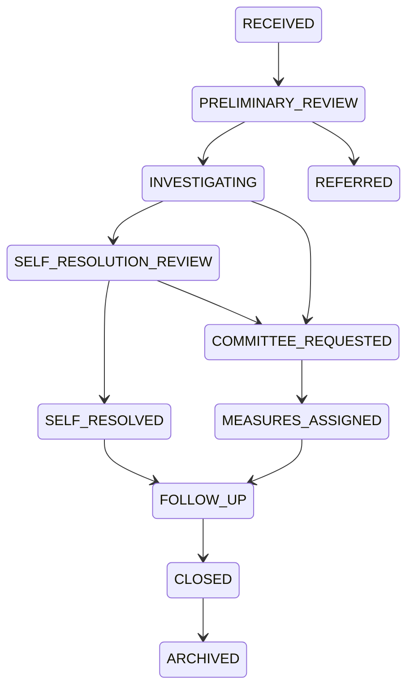

# 학교폭력 관리 프로그램 계약 플랜

> 작성일: 2026-04-13  
> 문서 상태: v0.3.0-contract  
> 대상 사용자: 특성화고 학교폭력 담당 교사  
> Planner: Codex  
> Backend: Codex, FastAPI  
> Frontend: Codex, React, Vite  
> 프론트 기준: `stitch(new)/10/code.html`, `stitch(new)/ai/code.html`
> 디자인 참고: `stitch(new)/equilibrium_admin/DESIGN.md`, `stitch(new)/10/screen.png`, `stitch(new)/ai/screen.png`
> 법령/서식 참고: `reference/`의 2026 충청북도교육청 PDF/HWPX, 국가법령정보센터의 학교폭력예방 및 대책에 관한 법률

---

## 0. 이 문서의 목적

이 문서는 기획, 백엔드, 프론트엔드가 같은 시스템을 만들 때 흔들리지 않도록 하는 단일 계약서다.

- Codex는 기획, API 계약, 백엔드, 프론트엔드, 데이터 모델, 보안 정책을 책임진다.
- Gemini/Sonnet 등 외부 모델 산출물은 참고 시안으로만 사용한다. 실제 적용 여부와 계약 준수 검증은 Codex가 맡는다.
- 프론트는 기존 디자인 문서가 아니라 `stitch(new)` 내보내기 화면을 기준으로 한다.
- 학교폭력 관련 판단, 조치, 문서 문구는 최종적으로 담당 교사가 검토한다. AI는 초안과 정리만 수행한다.
- 작업 원칙은 `agent.md`를 우선한다. 큰 범위 변경은 사용자에게 먼저 묻고, 구현은 기능별 모듈로 나눈다.

---

## 1. 제품 목표

특성화고의 학교폭력 담당 교사가 사안 접수부터 조사 기록, 자체해결 검토, 심의위원회 요청 자료, 조치 이행, 행정 서식 초안 생성까지 한 흐름에서 관리할 수 있는 업무 도구를 만든다.

### 1.1 MVP 범위

1. 사안 대시보드: 진행 상태, 긴급도, 마감일, 미처리 작업 확인.
2. 사안 접수: 발생 일시, 장소, 유형, 신고자, 관련 학생, 초기 진술 등록.
3. 학생/관계자 관리: 피해 관련 학생, 가해 관련 학생, 목격 학생, 보호자 연락 정보 관리.
4. 조사 기록: 담당자별 조사 내용, 증거, 요약, 제출 상태 관리.
5. 학교장 자체해결 검토: 체크리스트, 동의서 초안, 승인 흐름.
6. 심의위원회 요청/결과 관리: 요청 패키지, 회의록, 결과 보고서 초안 생성.
7. 조치 이행 관리: 피해학생 보호조치, 가해학생 선도/징계 조치, 마감일, 이행 여부 추적.
8. 서식 라이브러리: 자주 쓰는 서식과 AI 초안 생성 템플릿 관리.
9. 감사 로그: 누가 언제 어떤 민감 데이터를 조회/수정했는지 추적.
10. 복사 가능한 문구 생성: HWP를 직접 작성하지 않고 서식의 핵심 입력칸에 붙여넣을 `copy_blocks` 생성.

### 1.2 MVP에서 제외

- AI가 학교폭력 여부나 조치 수준을 최종 판정하는 기능.
- 학생/보호자가 직접 접속하는 포털.
- 교육지원청 공식 시스템과의 자동 제출 연계.
- HWP 바이너리 직접 편집과 모든 절차별 HWP 자동 작성. MVP는 공문/서식 프로그램에 붙여넣기 쉬운 텍스트 블록 생성을 우선하고, `hwpx`, `docx`, `pdf` export는 후순위로 둔다.

---

## 2. 작업 책임 계약

### 2.1 Planner, Codex

Planner Codex의 책임:

- 이 문서를 단일 기준으로 유지한다.
- API 경로, enum, 권한, 상태 전이 변경은 이 문서에서 먼저 반영한다.
- 백엔드 작업 순서와 통합 테스트 기준을 정의한다.
- 프론트 구현 중 계약 변경이 필요하면 변경 사유와 영향 범위를 판단한다.

### 2.2 Backend, Codex

Backend Codex의 책임:

- FastAPI 프로젝트를 구현한다.
- Pydantic 스키마와 SQLAlchemy 모델을 이 계약에 맞춘다.
- `/api/v1/openapi.json`을 생성하고 프론트가 타입 생성에 사용할 수 있게 한다.
- RBAC, 학교 단위 데이터 격리, 감사 로그, 파일 검증, AI 초안 생성 서비스를 구현한다.
- 계약과 구현이 다를 경우 구현을 고치거나 문서 변경 제안을 남긴다.

### 2.3 Frontend, Codex

Frontend Codex의 책임:

- `stitch(new)/10/code.html`과 `stitch(new)/ai/code.html`을 React 컴포넌트 구조로 해체해 구현한다.
- `stitch(new)/equilibrium_admin/DESIGN.md`의 "Stoic Archivist" 방향성을 반영한다.
- `stitch(new)/10/screen.png`와 `stitch(new)/ai/screen.png`의 화면 골격을 우선한다.
- Tailwind CSS와 Material Symbols를 사용한다.
- API 경로, 응답 envelope, enum, 권한 정책을 임의로 바꾸지 않는다.
- 백엔드가 없을 때는 이 문서의 예시 응답을 mock으로 사용하되 mock shape를 실제 계약과 동일하게 유지한다.
- 외부 모델이 만든 프론트 코드는 그대로 적용하지 않고 빌드, 접근성, 계약 준수 여부를 검증한 뒤 반영한다.

---

## 3. 디자인 계약

프론트는 아래 디자인 자료를 반드시 참조한다.

| 자료 | 용도 |
|---|---|
| `stitch(new)/equilibrium_admin/DESIGN.md` | Stoic Archivist 시각 방향성, 색상, 타이포그래피, 여백, 표면 계층, 버튼 규칙 |
| `stitch(new)/10/code.html`, `stitch(new)/ai/code.html` | Tailwind/Material Symbols 기반 화면 골격 |
| `stitch(new)/10/screen.png`, `stitch(new)/ai/screen.png` | 최종 화면 밀도, 비율, 작업공간 배치 참고 |

### 3.1 화면 매핑

| 라우트 | 화면 | 디자인 참조 |
|---|---|---|
| `/dashboard` | 사안 관리 대시보드 | 추후 별도 Stitch 시안 확정 |
| `/cases/new` | 사안 접수 및 서식10 초안 작성 | `stitch(new)/10/screen.png` |
| `/cases/:caseId` | 사안 상세 워크스페이스 | `stitch(new)/ai/screen.png`의 dossier/workspace 구조 |
| `/cases/:caseId/investigations` | 조사 기록 관리 | `stitch(new)/ai/screen.png`의 좌측 source/우측 draft 구조 확장 |
| `/cases/:caseId/documents` | 서식12 기반 후속 드래프트 생성 | `stitch(new)/ai/screen.png` |
| `/templates` | 서식 및 템플릿 라이브러리 | 추후 별도 Stitch 시안 확정 |

### 3.2 디자인 구현 규칙

- 큰 제목, 본문, 진술, 폼, 메타데이터는 Pretendard 중심으로 사용하고 Inter는 보조로 둔다.
- 1px 구분선으로 화면을 쪼개지 않는다. 표면 색상과 여백으로 구획한다.
- 색상은 `stitch(new)/equilibrium_admin/DESIGN.md`의 표면 계층을 따르되, 전체 화면이 한 가지 파란색 계열로만 보이지 않게 상태 색과 중립 색을 균형 있게 사용한다.
- 버튼 반경은 8px 이하로 유지한다.
- 긴 학생 이름, 사안 제목, 행정 문구가 모바일에서도 부모 영역을 넘치지 않게 한다.
- 주요 복사 액션은 눈에 잘 띄게 제공하되, 복사 후 성공 상태를 표시한다.
- 사안접수 화면은 스티치의 서식10 문서 미리보기 패널을 우선한다.
- 문서 생성 화면은 좌측 `<서식12>` 원천 입력 dossier와 우측 `<서식18/19/20/21/22>` 드래프트 보드를 우선한다.

### 3.3 `stitch(new)` 디자인 시스템 반영 항목

`stitch(new)/equilibrium_admin/DESIGN.md`는 프론트 구현의 메인 디자인 기준이다. 구현 시 아래 항목을 우선 반영한다.

- 디자인 방향은 `The Stoic Archivist`로 고정한다. 복잡한 대시보드보다 정돈된 행정 dossier와 문서 작업실의 인상을 우선한다.
- 화면 구획은 선보다 표면 계층으로 나눈다. 기본 배경은 `#f8f9ff`, 주요 사이드/작업 영역은 `#eff4ff`, 활성 문서와 복사 블록은 `#ffffff`, 상호작용 표면은 `#dce9ff`를 기준으로 한다.
- 핵심 색은 Indigo `#2d409f`, Slate 계열 텍스트, Soft Sage 상태색을 함께 사용한다. 긴장도가 높은 문서 작업 UI가 차갑거나 단색으로 보이지 않게 한다.
- AI 생성 초안 영역은 `surface-container-low`에서 Soft Sage로 이어지는 은은한 그라데이션을 사용하고, 담당 교사 검토가 필요하다는 의미가 드러나게 한다.
- Copy Block 카드는 흰 표면, 8px 이하 반경, 짧은 라벨, 충분한 세로 여백, 복사 버튼, 출처 서식/대상 필드/글자 수 제한 메타데이터를 포함한다.
- 입력 영역은 부드러운 채움 배경을 사용하고, 과한 테두리나 중첩 카드 구조를 피한다.
- `DESIGN.md`에는 한국어 본문 자간을 음수로 제안하는 부분이 있으나, 본 프로젝트의 프론트 구현 규칙상 `letter-spacing: 0`을 유지한다.

---

## 4. 도메인 원칙

### 4.1 사람과 역할

| Role | 설명 | 기본 범위 |
|---|---|---|
| `SYSTEM_ADMIN` | 시스템 관리자 | 전체 시스템 설정과 사용자 관리 |
| `SCHOOL_VIOLENCE_MANAGER` | 학교폭력 담당 교사 | 사안 생성, 수정, 문서 생성, 조치 이행 관리 |
| `PRINCIPAL` | 교장 | 소속 학교 사안 조회, 자체해결/문서 승인 |
| `INVESTIGATION_PARTNER` | 외부 또는 위촉 조사 담당자 | 배정된 사안의 조사 기록 작성 |
| `COMMITTEE_VIEWER` | 전담기구/심의 관련 열람자 | 배정된 사안 읽기 전용 |
| `HOMEROOM_TEACHER` | 담임교사 | 배정 또는 관련 학생 사안 일부 조회 |

모든 조회는 `school_id`로 격리한다. `SYSTEM_ADMIN` 외에는 다른 학교 데이터를 볼 수 없다.

### 4.2 민감 정보 원칙

- 학생 이름, 생년월일, 보호자 연락처, 진술, 증거 파일은 민감 정보로 본다.
- 목록 화면에는 최소 정보만 노출한다.
- 상세 진술과 증거 파일 조회는 감사 로그를 남긴다.
- AI 문서 생성 시 기본값은 익명화다.
- AI가 생성한 문서는 항상 `DRAFT`로 시작하고 교사 검토 없이는 승인 상태가 될 수 없다.

### 4.3 법령 용어 원칙

- 심의 관련 공식 용어는 `학교폭력대책심의위원회`를 우선한다.
- 학교 내부 회의/정리는 `전담기구` 용어를 쓰되, 최종 문서에는 담당 교사가 확인한다.
- 디지털/딥페이크 관련 사안은 별도 하위 유형으로 기록할 수 있어야 한다.
- 법령/지침 변경 가능성이 있으므로 문구 템플릿에는 `source_version`과 `review_required`를 기록한다.

### 4.4 서식 중심 문구 생성 원칙

PDF 원문은 아래한글 문서를 변환한 참고 자료다. MVP는 모든 HWP 파일을 직접 재작성하지 않고, 사용자가 공문 기록 프로그램이나 서식 파일에 직접 복사 및 붙여넣기 쉬운 문구 블록을 생성한다.

`<서식12>` 사안조사 보고서는 외주 조사관 입력을 받는 핵심 source다. `<서식18>`, `<서식19>`, `<서식20>`, `<서식21>`, `<서식22>`는 `<서식12>` 저장 내용 또는 그 파생 결과를 source로 삼는다. source가 없으면 문구를 추론 생성하지 않고 `FORM_SOURCE_REQUIRED`를 반환한다.

| 서식 | DocumentType | 입력 source | 생성 대상 | 문체/제약 |
|---|---|---|---|---|
| `<서식10>` 사안접수 보고 | `FORM_10_CASE_INTAKE` | 사용자가 두서없이 적은 `사실 확인내용` | 사안접수 보고용 사실 확인 문구 | 행정문체로 정리, 판단 단정 금지 |
| `<서식12>` 사안조사 보고서 | `FORM_12_INVESTIGATION_REPORT` | 외주 조사관 입력란 | 이후 서식 생성의 핵심 source 저장 | 원문 보존, 수정 이력 관리 |
| `<서식18>` 전담기구 심의결과 보고서 | `FORM_18_COMMITTEE_REVIEW_RESULT` | `<서식12>` | `심의내용` | 개조식, 행정기관 문체, 500자 이내 |
| `<서식19>` 전담기구 심의결과 보고서[종결] | `FORM_19_COMMITTEE_CLOSURE_RESULT` | `<서식12>` | 종결용 `심의내용` | 개조식, 행정기관 문체, 500자 이내 |
| `<서식20>` 학교장 자체해결 동의서 | `FORM_20_SELF_RESOLUTION_CONSENT` | `<서식12>` 및 자체해결 예시 문구 | 동의서 사안 요약/관련 내용 | 보호자가 읽는 중립 문체, 400자 이내 |
| `<서식21>` 학교장 자체해결 결과 관련 서식 | `FORM_21_SELF_RESOLUTION_RESULT` | `<서식12>` | 자체해결 결과 관련 내용 | 보호자가 읽는 중립 문체, 400자 이내 |
| `<서식22>` 최종 사안조사 내용 | `FORM_22_FINAL_CASE_SUMMARY` | `<서식19>`, `<서식20>`, `<서식21>` | `사안조사 내용` | 종합 요약, 400자 이내 |

---

## 5. 상태 모델

### 5.1 CaseStatus

| Status | 의미 |
|---|---|
| `RECEIVED` | 사안 접수 완료 |
| `PRELIMINARY_REVIEW` | 사안 기초 확인 및 긴급성 검토 |
| `INVESTIGATING` | 조사 진행 |
| `SELF_RESOLUTION_REVIEW` | 학교장 자체해결 가능성 검토 |
| `SELF_RESOLVED` | 학교장 자체해결 완료 |
| `COMMITTEE_REQUESTED` | 학교폭력대책심의위원회 요청 또는 이관 준비 |
| `MEASURES_ASSIGNED` | 조치 결정 후 이행 관리 |
| `FOLLOW_UP` | 사후 확인 및 이행 점검 |
| `CLOSED` | 종결 |
| `REFERRED` | 교육지원청 등 외부 기관 이관 |
| `ARCHIVED` | 보관 상태 |

### 5.2 상태 전이



상태 전이는 `PATCH /api/v1/cases/{case_id}/status`에서만 수행한다. 전이 실패는 `409 CASE_INVALID_STATUS_TRANSITION`으로 응답한다.

---

## 6. 공통 API 규약

### 6.1 Base

- Base URL: `/api/v1`
- 모든 표의 Path는 절대 경로로 작성한다.
- 기본 Content-Type: `application/json; charset=utf-8`
- 파일 업로드: `multipart/form-data`
- 날짜/시간: ISO 8601, 예: `2026-04-13T09:00:00+09:00`
- 날짜: `YYYY-MM-DD`
- ID: UUID v4

### 6.2 성공 응답 envelope

모든 JSON 성공 응답은 같은 envelope를 쓴다.

```json
{
  "status": "success",
  "data": {},
  "meta": {
    "request_id": "uuid",
    "timestamp": "2026-04-13T09:00:00+09:00"
  }
}
```

목록 응답은 offset pagination으로 고정한다.

```json
{
  "status": "success",
  "data": [],
  "pagination": {
    "page": 1,
    "page_size": 20,
    "total_count": 0,
    "total_pages": 0
  },
  "meta": {
    "request_id": "uuid",
    "timestamp": "2026-04-13T09:00:00+09:00"
  }
}
```

### 6.3 페이지네이션

v1 목록 API는 offset 방식만 사용한다.

| Query | 타입 | 기본값 | 설명 |
|---|---:|---:|---|
| `page` | int | 1 | 페이지 번호 |
| `page_size` | int | 20 | 페이지 크기, 최대 100 |
| `sort_by` | string | `created_at` | 정렬 필드 |
| `sort_order` | string | `desc` | `asc` 또는 `desc` |
| `search` | string |  | 검색어 |

대용량 감사 로그에 cursor가 필요해지면 `/api/v1/audit-events`에서 별도 계약을 추가한다.

### 6.4 에러 응답

```json
{
  "status": "error",
  "error": {
    "code": "VALIDATION_ERROR",
    "message": "입력값이 유효하지 않습니다.",
    "details": [
      {
        "field": "title",
        "message": "제목은 필수 항목입니다."
      }
    ]
  },
  "meta": {
    "request_id": "uuid",
    "timestamp": "2026-04-13T09:00:00+09:00"
  }
}
```

FastAPI 기본 validation 응답은 그대로 노출하지 않는다. 백엔드는 위 형식으로 변환하는 exception handler를 구현한다.

### 6.5 파일 응답 예외

파일 다운로드와 export는 JSON envelope를 쓰지 않는다.

| 확장자 | Content-Type |
|---|---|
| `pdf` | `application/pdf` |
| `docx` | `application/vnd.openxmlformats-officedocument.wordprocessingml.document` |
| `hwpx` | `application/vnd.hancom.hwpx` |
| `zip` | `application/zip` |

파일 응답은 `Content-Disposition: attachment; filename*=UTF-8''...`를 포함한다.

---

## 7. 인증과 세션

### 7.1 OAuth 기본 정책

- 운영 환경은 SSO/OAuth 2.0 Authorization Code Flow with PKCE를 사용한다.
- `/auth/login`은 `state`, `nonce`, `code_challenge`를 생성한다.
- `/auth/callback`은 `state`, `nonce`, `code_verifier`를 검증한다.
- refresh token은 `HttpOnly`, `Secure`, `SameSite=Lax` cookie로 저장한다.
- access token은 짧게 유지하고 프론트는 메모리에만 보관한다.
- 로컬 개발은 `/auth/dev-login`을 별도로 둔다.

### 7.2 Auth endpoints

| Method | Path | 설명 | Auth |
|---|---|---|---|
| `GET` | `/api/v1/auth/login` | OAuth 로그인 시작 URL 반환 | Public |
| `GET` | `/api/v1/auth/callback` | OAuth callback 처리 | Public |
| `POST` | `/api/v1/auth/dev-login` | 로컬 개발용 mock 로그인 | Public, dev only |
| `POST` | `/api/v1/auth/refresh` | access token 재발급 | Refresh cookie |
| `POST` | `/api/v1/auth/logout` | refresh cookie 무효화, token blacklist | Required |
| `GET` | `/api/v1/auth/me` | 현재 사용자 정보 | Required |

---

## 8. 권한 매트릭스

| 리소스 | Manager | Principal | Investigation Partner | Committee Viewer | Homeroom Teacher | Admin |
|---|---|---|---|---|---|---|
| 사안 목록 | 전체 | 소속 학교 전체 | 배정건 | 배정건 | 관련 학생 건 | 전체 |
| 사안 상세 | 전체 | 소속 학교 전체 | 배정건 | 배정건 읽기 | 관련 학생 건 제한 조회 | 전체 |
| 사안 생성/수정 | 가능 | 불가 | 불가 | 불가 | 불가 | 가능 |
| 조사 기록 작성 | 가능 | 불가 | 배정건 가능 | 불가 | 불가 | 가능 |
| 증거 업로드 | 가능 | 불가 | 배정건 가능 | 불가 | 불가 | 가능 |
| 문서 생성 | 가능 | 불가 | 불가 | 불가 | 불가 | 가능 |
| 문서 승인 | 가능 | 가능 | 불가 | 불가 | 불가 | 가능 |
| 조치 이행 수정 | 가능 | 조회 | 불가 | 불가 | 불가 | 가능 |
| 감사 로그 조회 | 제한 | 불가 | 불가 | 불가 | 불가 | 전체 |

상세 조회 권한은 목록 조회 권한보다 좁아질 수 있지만, 프론트가 접근 가능한 목록 항목은 상세 접근 가능 여부를 함께 받는다.

---

## 9. 핵심 데이터 모델

### 9.1 School

| Field | Type | 설명 |
|---|---|---|
| `id` | uuid | 학교 ID |
| `name` | string | 학교명 |
| `school_type` | enum | `SPECIALIZED_HIGH`, `GENERAL_HIGH`, `MIDDLE`, `OTHER` |
| `region_code` | string | 교육청/지역 코드 |
| `created_at` | datetime | 생성 시각 |

### 9.2 User

| Field | Type | 설명 |
|---|---|---|
| `id` | uuid | 사용자 ID |
| `school_id` | uuid | 소속 학교 |
| `email` | string | 이메일 |
| `name` | string | 이름 |
| `role` | enum | 권한 role |
| `department` | string | 부서 |
| `is_active` | bool | 활성 여부 |
| `last_login_at` | datetime | 마지막 로그인 |

### 9.3 Student

| Field | Type | 설명 |
|---|---|---|
| `id` | uuid | 학생 ID |
| `school_id` | uuid | 학교 ID |
| `student_number` | string | 학번 |
| `name` | string | 이름 |
| `grade` | int | 학년 |
| `class_number` | int | 반 |
| `number_in_class` | int | 번호 |
| `department_name` | string nullable | 특성화고 학과명 |
| `major_track` | string nullable | 전공/트랙 |
| `homeroom_teacher_id` | uuid nullable | 담임 |
| `guardian_name` | string nullable | 보호자명 |
| `guardian_phone` | string nullable | 보호자 연락처 |
| `created_at` | datetime | 생성 시각 |
| `updated_at` | datetime | 수정 시각 |

### 9.4 Case

| Field | Type | 설명 |
|---|---|---|
| `id` | uuid | 사안 ID |
| `school_id` | uuid | 학교 ID |
| `case_number` | string | 예: `2026-SV-0042` |
| `title` | string | 사안 제목 |
| `status` | CaseStatus | 진행 상태 |
| `category` | enum | `PHYSICAL`, `VERBAL`, `CYBER_DIGITAL`, `SEXUAL`, `SOCIAL_EXCLUSION`, `COERCION`, `PROPERTY`, `OTHER` |
| `subcategory` | string nullable | 예: 딥페이크, 단체채팅방, 실습실 등 |
| `severity` | enum | `LOW`, `MEDIUM`, `HIGH`, `CRITICAL` |
| `incident_date` | date nullable | 발생일 |
| `incident_location` | string nullable | 장소 |
| `description` | text | 사안 개요 |
| `report_source` | enum | `STUDENT`, `GUARDIAN`, `TEACHER`, `ANONYMOUS`, `POLICE`, `OTHER` |
| `reported_at` | datetime | 신고/접수 시각 |
| `due_date` | date nullable | 다음 처리 마감일 |
| `assigned_investigator_id` | uuid nullable | 조사 담당자 |
| `created_by` | uuid | 생성자 |
| `created_at` | datetime | 생성 시각 |
| `updated_at` | datetime | 수정 시각 |

### 9.5 CaseParticipant

| Field | Type | 설명 |
|---|---|---|
| `id` | uuid | 관계자 ID |
| `case_id` | uuid | 사안 ID |
| `student_id` | uuid | 학생 ID |
| `role` | enum | `VICTIM_RELATED`, `PERPETRATOR_RELATED`, `WITNESS`, `REPORTER`, `OTHER` |
| `statement_summary` | text nullable | 초기 진술 요약 |
| `statement_recorded_at` | datetime nullable | 진술 기록 시각 |
| `statement_recorded_by` | uuid nullable | 기록자 |
| `privacy_level` | enum | `NORMAL`, `SENSITIVE`, `RESTRICTED` |

### 9.6 InvestigationRecord

| Field | Type | 설명 |
|---|---|---|
| `id` | uuid | 조사 기록 ID |
| `case_id` | uuid | 사안 ID |
| `author_id` | uuid | 작성자 |
| `type` | enum | `INITIAL`, `SUPPLEMENTARY`, `FINAL` |
| `content` | text | 조사 내용 |
| `findings_summary` | text nullable | 요약 |
| `submitted_at` | datetime nullable | 제출 시각 |
| `status` | enum | `DRAFT`, `SUBMITTED`, `RETURNED`, `LOCKED` |

### 9.7 EvidenceFile

| Field | Type | 설명 |
|---|---|---|
| `id` | uuid | 파일 ID |
| `case_id` | uuid | 사안 ID |
| `uploaded_by` | uuid | 업로더 |
| `file_name` | string | 원본 파일명 |
| `file_type` | enum | `IMAGE`, `DOCUMENT`, `AUDIO`, `VIDEO`, `ARCHIVE`, `OTHER` |
| `mime_type` | string | MIME |
| `size_bytes` | int | 크기 |
| `storage_key` | string | 내부 저장 키 |
| `description` | string nullable | 설명 |
| `created_at` | datetime | 업로드 시각 |

### 9.8 Measure

| Field | Type | 설명 |
|---|---|---|
| `id` | uuid | 조치 ID |
| `case_id` | uuid | 사안 ID |
| `target_student_id` | uuid | 대상 학생 |
| `target_role` | enum | `VICTIM_RELATED`, `PERPETRATOR_RELATED` |
| `measure_group` | enum | `VICTIM_PROTECTION`, `PERPETRATOR_GUIDANCE`, `OTHER` |
| `measure_code` | string | 조치 코드 |
| `measure_label` | string | 화면 표시명 |
| `decision_body` | enum | `SCHOOL_PRINCIPAL`, `DELIBERATION_COMMITTEE`, `OTHER` |
| `decision_date` | date | 결정일 |
| `compliance_status` | enum | `PENDING`, `IN_PROGRESS`, `COMPLETED`, `OVERDUE`, `APPEALED`, `WAIVED` |
| `deadline` | date nullable | 이행 마감 |
| `completed_at` | datetime nullable | 완료 시각 |
| `notes` | text nullable | 이행 메모 |

`measure_code`는 백엔드 seed 데이터로 관리한다. 피해학생 보호조치와 가해학생 조치의 코드를 한 enum으로 섞지 않는다.

### 9.9 Document

| Field | Type | 설명 |
|---|---|---|
| `id` | uuid | 문서 ID |
| `case_id` | uuid | 사안 ID |
| `document_type` | enum | 문서 유형 |
| `title` | string | 제목 |
| `content` | text | Markdown 본문 |
| `content_format` | enum | `MARKDOWN`, `HTML` |
| `copy_blocks` | CopyBlock[] | 복사 및 붙여넣기용 항목별 생성 문구 |
| `status` | enum | `DRAFT`, `TEACHER_REVIEWED`, `PRINCIPAL_APPROVED`, `EXPORTED`, `ARCHIVED` |
| `version` | int | 버전 |
| `source_version` | string nullable | 법령/서식 기준 버전 |
| `ai_model_used` | string nullable | AI 모델 |
| `prompt_version` | string nullable | 프롬프트 버전 |
| `review_required` | bool | 교사 검토 필요 여부 |
| `created_by` | uuid | 생성자 |
| `created_at` | datetime | 생성 시각 |
| `updated_at` | datetime | 수정 시각 |

### 9.10 CopyBlock

`CopyBlock`은 서식 전체 파일을 만들기보다 사용자가 필요한 칸에 바로 붙여넣을 수 있도록 만든 최소 출력 단위다.

| Field | Type | 설명 |
|---|---|---|
| `label` | string | 화면 표시명, 예: `심의내용 500자 요약` |
| `source_form` | enum | 생성 근거 서식, 예: `FORM_12_INVESTIGATION_REPORT` |
| `target_form` | enum | 붙여넣을 대상 서식 |
| `target_field` | string | 대상 입력칸, 예: `심의내용`, `사안조사 내용` |
| `text` | text | 복사할 최종 문구 |
| `char_limit` | int nullable | 글자 수 제한 |
| `style_profile` | enum | `ADMINISTRATIVE_PROSE`, `BULLET_ADMIN`, `GUARDIAN_NEUTRAL`, `RAW_SOURCE` |
| `review_required` | bool | 교사 검토 필요 여부 |

### 9.11 GeneratedTextBlock

| Field | Type | 설명 |
|---|---|---|
| `id` | uuid | 생성 문구 ID |
| `case_id` | uuid | 사안 ID |
| `document_id` | uuid nullable | 연결된 문서 ID |
| `source_form` | enum | source 서식 |
| `target_form` | enum | target 서식 |
| `target_field` | string | 붙여넣을 대상 입력칸 |
| `text` | text | 생성 문구 |
| `char_limit` | int nullable | 글자 수 제한 |
| `style_profile` | enum | 문체 profile |
| `created_by` | uuid | 생성자 |
| `created_at` | datetime | 생성 시각 |

### 9.12 AuditEvent

| Field | Type | 설명 |
|---|---|---|
| `id` | uuid | 이벤트 ID |
| `school_id` | uuid | 학교 ID |
| `actor_id` | uuid nullable | 수행자 |
| `action` | string | 예: `CASE_VIEWED`, `DOCUMENT_APPROVED` |
| `resource_type` | string | 리소스 타입 |
| `resource_id` | uuid nullable | 리소스 ID |
| `ip_address` | string nullable | IP |
| `user_agent` | string nullable | User Agent |
| `created_at` | datetime | 생성 시각 |

---

## 10. API 엔드포인트

### 10.1 Dashboard

| Method | Path | 설명 | 권한 |
|---|---|---|---|
| `GET` | `/api/v1/dashboard/summary` | 사안 수, 긴급도, 마감 작업 요약 | Required |
| `GET` | `/api/v1/dashboard/tasks` | 내 할 일 목록 | Required |
| `GET` | `/api/v1/dashboard/cases-by-status` | 상태별 집계 | Required |

### 10.2 Cases

| Method | Path | 설명 | 권한 |
|---|---|---|---|
| `POST` | `/api/v1/cases` | 사안 접수 | Manager, Admin |
| `GET` | `/api/v1/cases` | 사안 목록 | Role scoped |
| `GET` | `/api/v1/cases/{case_id}` | 사안 상세 | Role scoped |
| `PATCH` | `/api/v1/cases/{case_id}` | 사안 기본 정보 수정 | Manager, Admin |
| `PATCH` | `/api/v1/cases/{case_id}/status` | 상태 변경 | Manager, Admin |
| `DELETE` | `/api/v1/cases/{case_id}` | soft delete | Admin |

#### POST /api/v1/cases

```json
{
  "title": "3학년 실습실 내 언어폭력 의심 사안",
  "category": "VERBAL",
  "subcategory": "실습실",
  "severity": "MEDIUM",
  "incident_date": "2026-04-10",
  "incident_location": "기계과 실습실",
  "description": "점심시간 이후 실습 준비 중 발생한 언어폭력 의심 사안",
  "report_source": "TEACHER",
  "reported_at": "2026-04-13T09:00:00+09:00",
  "participants": [
    {
      "student_id": "uuid",
      "role": "VICTIM_RELATED",
      "statement_summary": "반복적으로 모욕적인 말을 들었다고 진술함"
    }
  ]
}
```

### 10.3 Participants

| Method | Path | 설명 | 권한 |
|---|---|---|---|
| `POST` | `/api/v1/cases/{case_id}/participants` | 관계 학생 추가 | Manager, Admin |
| `GET` | `/api/v1/cases/{case_id}/participants` | 관계 학생 목록 | Role scoped |
| `PATCH` | `/api/v1/cases/{case_id}/participants/{participant_id}` | 관계 정보 수정 | Manager, Admin |
| `DELETE` | `/api/v1/cases/{case_id}/participants/{participant_id}` | 관계 학생 제거 | Manager, Admin |

### 10.4 Students

| Method | Path | 설명 | 권한 |
|---|---|---|---|
| `POST` | `/api/v1/students` | 학생 등록 | Manager, Admin |
| `GET` | `/api/v1/students` | 학생 검색 | Manager, Admin |
| `GET` | `/api/v1/students/{student_id}` | 학생 상세 | Manager, Admin, scoped Homeroom |
| `PATCH` | `/api/v1/students/{student_id}` | 학생 정보 수정 | Manager, Admin |
| `GET` | `/api/v1/students/{student_id}/cases` | 학생 관련 사안 이력 | Manager, Admin, scoped Homeroom |

### 10.5 Investigations

| Method | Path | 설명 | 권한 |
|---|---|---|---|
| `POST` | `/api/v1/cases/{case_id}/investigations` | 조사 기록 작성 | Manager, assigned Partner |
| `GET` | `/api/v1/cases/{case_id}/investigations` | 조사 기록 목록 | Role scoped |
| `GET` | `/api/v1/cases/{case_id}/investigations/{record_id}` | 조사 기록 상세 | Role scoped |
| `PATCH` | `/api/v1/cases/{case_id}/investigations/{record_id}` | 조사 기록 수정 | Author, Manager |
| `POST` | `/api/v1/cases/{case_id}/investigations/{record_id}/submit` | 조사 기록 제출 | Author, Manager |
| `POST` | `/api/v1/cases/{case_id}/investigations/{record_id}/return` | 보완 요청 | Manager |

### 10.6 Evidence

| Method | Path | 설명 | 권한 |
|---|---|---|---|
| `POST` | `/api/v1/cases/{case_id}/evidence` | 증거 파일 업로드 | Manager, assigned Partner |
| `GET` | `/api/v1/cases/{case_id}/evidence` | 증거 목록 | Role scoped |
| `GET` | `/api/v1/cases/{case_id}/evidence/{evidence_id}` | 증거 메타데이터 | Role scoped |
| `GET` | `/api/v1/cases/{case_id}/evidence/{evidence_id}/download` | 증거 파일 다운로드 | Role scoped, audited |
| `DELETE` | `/api/v1/cases/{case_id}/evidence/{evidence_id}` | 증거 삭제 | Manager, Admin |

파일 크기 기본 제한은 50MB다. 허용 MIME 타입은 백엔드 설정에서 whitelist로 관리한다.

### 10.7 Measures

| Method | Path | 설명 | 권한 |
|---|---|---|---|
| `POST` | `/api/v1/cases/{case_id}/measures` | 조치 등록 | Manager, Admin |
| `GET` | `/api/v1/cases/{case_id}/measures` | 조치 목록 | Role scoped |
| `PATCH` | `/api/v1/cases/{case_id}/measures/{measure_id}` | 조치 수정 | Manager, Admin |
| `PATCH` | `/api/v1/cases/{case_id}/measures/{measure_id}/compliance` | 이행 상태 수정 | Manager, Admin |
| `GET` | `/api/v1/measure-codes` | 조치 코드 목록 | Required |

### 10.8 Documents and AI Drafts

| Method | Path | 설명 | 권한 |
|---|---|---|---|
| `POST` | `/api/v1/cases/{case_id}/documents/generate` | AI 문서 생성 job 시작 | Manager, Admin |
| `GET` | `/api/v1/document-jobs/{job_id}` | 문서 생성 job 상태 | Request owner, Manager |
| `GET` | `/api/v1/cases/{case_id}/documents` | 문서 목록 | Role scoped |
| `GET` | `/api/v1/cases/{case_id}/documents/{document_id}` | 문서 상세 | Role scoped |
| `PATCH` | `/api/v1/cases/{case_id}/documents/{document_id}` | 문서 본문 수정 | Manager, Admin |
| `POST` | `/api/v1/cases/{case_id}/documents/{document_id}/approve` | 문서 승인 | Manager, Principal, Admin |
| `POST` | `/api/v1/cases/{case_id}/documents/{document_id}/regenerate` | 피드백 기반 재생성 job 시작 | Manager, Admin |
| `GET` | `/api/v1/cases/{case_id}/documents/{document_id}/export` | 문서 export | Manager, Principal, Admin |

#### POST /api/v1/cases/{case_id}/documents/generate

기본 응답은 `202 Accepted`다.

```json
{
  "document_type": "FORM_18_COMMITTEE_REVIEW_RESULT",
  "source_ids": {
    "investigation_report_id": "uuid"
  },
  "options": {
    "anonymize_names": true,
    "summary_max_chars": 500,
    "output_mode": "COPY_BLOCKS",
    "target_field": "심의내용"
  }
}
```

성공 시 job 결과 또는 동기 생성 결과의 `data`에는 `copy_blocks`가 포함된다.

```json
{
  "status": "success",
  "data": {
    "document_type": "FORM_18_COMMITTEE_REVIEW_RESULT",
    "copy_blocks": [
      {
        "label": "서식18 심의내용",
        "source_form": "FORM_12_INVESTIGATION_REPORT",
        "target_form": "FORM_18_COMMITTEE_REVIEW_RESULT",
        "target_field": "심의내용",
        "text": "조사관이 제출한 사안조사 보고서에 따르면 ...",
        "char_limit": 500,
        "style_profile": "BULLET_ADMIN",
        "review_required": true
      }
    ]
  },
  "meta": {
    "request_id": "uuid",
    "timestamp": "2026-04-13T09:00:00+09:00"
  }
}
```

#### DocumentType

| Type | 설명 |
|---|---|
| `FORM_10_CASE_INTAKE` | `<서식10>` 사안접수 보고 |
| `FORM_12_INVESTIGATION_REPORT` | `<서식12>` 사안조사 보고서, 외주 조사관 입력 source |
| `FORM_18_COMMITTEE_REVIEW_RESULT` | `<서식18>` 전담기구 심의결과 보고서 |
| `FORM_19_COMMITTEE_CLOSURE_RESULT` | `<서식19>` 전담기구 심의결과 보고서[종결] |
| `FORM_20_SELF_RESOLUTION_CONSENT` | `<서식20>` 학교장 자체해결 동의서 |
| `FORM_21_SELF_RESOLUTION_RESULT` | `<서식21>` 학교장 자체해결 결과 관련 서식 |
| `FORM_22_FINAL_CASE_SUMMARY` | `<서식22>` 최종 사안조사 내용 |
| `SELF_RESOLUTION_CHECKLIST` | 학교장 자체해결 체크리스트 |
| `COMMITTEE_REQUEST_PACKAGE` | 심의위원회 요청 자료 묶음 |
| `RESULT_NOTICE_DRAFT` | 결과 통지문 초안 |
| `CUSTOM_TEMPLATE` | 사용자 지정 서식 |

AI 생성 결과는 사실관계 정리, 문장 정돈, 서식 초안 작성으로 제한한다. 최종 판단처럼 보이는 표현은 `review_required=true`로 남긴다.

#### 서식별 생성 규칙

| Target DocumentType | Required source | Output `copy_blocks.target_field` | 제한 |
|---|---|---|---|
| `FORM_10_CASE_INTAKE` | 사용자 입력 `raw_fact_check_content` | `사실 확인내용` | 행정문체, 판단 단정 금지 |
| `FORM_12_INVESTIGATION_REPORT` | 조사관 입력 원문 | `사안조사 보고서 원문` | 원문 저장, 후속 생성 source |
| `FORM_18_COMMITTEE_REVIEW_RESULT` | `FORM_12_INVESTIGATION_REPORT` | `심의내용` | 500자 이내, 개조식 행정문체 |
| `FORM_19_COMMITTEE_CLOSURE_RESULT` | `FORM_12_INVESTIGATION_REPORT` | `심의내용` | 500자 이내, 개조식 행정문체 |
| `FORM_20_SELF_RESOLUTION_CONSENT` | `FORM_12_INVESTIGATION_REPORT` | `사안 요약` | 400자 이내, 보호자 대상 중립 문체 |
| `FORM_21_SELF_RESOLUTION_RESULT` | `FORM_12_INVESTIGATION_REPORT` | `자체해결 결과 내용` | 400자 이내, 보호자 대상 중립 문체 |
| `FORM_22_FINAL_CASE_SUMMARY` | `FORM_19_COMMITTEE_CLOSURE_RESULT`, `FORM_20_SELF_RESOLUTION_CONSENT`, `FORM_21_SELF_RESOLUTION_RESULT` | `사안조사 내용` | 400자 이내, 종합 요약 |

### 10.9 Templates

| Method | Path | 설명 | 권한 |
|---|---|---|---|
| `GET` | `/api/v1/templates` | 서식 템플릿 목록 | Required |
| `GET` | `/api/v1/templates/{template_id}` | 템플릿 상세 | Required |
| `POST` | `/api/v1/templates` | 템플릿 생성 | Manager, Admin |
| `PATCH` | `/api/v1/templates/{template_id}` | 템플릿 수정 | Manager, Admin |
| `DELETE` | `/api/v1/templates/{template_id}` | 템플릿 비활성화 | Admin |

### 10.10 Audit

| Method | Path | 설명 | 권한 |
|---|---|---|---|
| `GET` | `/api/v1/audit-events` | 감사 로그 조회 | Admin, limited Manager |
| `GET` | `/api/v1/cases/{case_id}/audit-events` | 특정 사안 감사 로그 | Manager, Admin |

---

## 11. 에러 코드

| Code | HTTP | 설명 |
|---|---:|---|
| `VALIDATION_ERROR` | 422 | 입력값 검증 실패 |
| `AUTH_REQUIRED` | 401 | 인증 필요 |
| `AUTH_TOKEN_EXPIRED` | 401 | access token 만료 |
| `AUTH_INVALID_STATE` | 401 | OAuth state 검증 실패 |
| `AUTH_INSUFFICIENT_ROLE` | 403 | 권한 부족 |
| `SCHOOL_SCOPE_VIOLATION` | 403 | 다른 학교 데이터 접근 |
| `CASE_NOT_FOUND` | 404 | 사안 없음 |
| `CASE_INVALID_STATUS_TRANSITION` | 409 | 상태 전이 불가 |
| `STUDENT_NOT_FOUND` | 404 | 학생 없음 |
| `DOCUMENT_NOT_FOUND` | 404 | 문서 없음 |
| `DOCUMENT_ALREADY_APPROVED` | 409 | 승인된 문서 수정 시도 |
| `DOCUMENT_JOB_RUNNING` | 409 | 생성 job 진행 중 |
| `FORM_SOURCE_REQUIRED` | 422 | `<서식12>` 등 필수 source 없이 파생 서식 생성을 요청함 |
| `AI_SERVICE_UNAVAILABLE` | 503 | AI 서비스 장애 |
| `AI_GENERATION_FAILED` | 500 | AI 생성 실패 |
| `FILE_TOO_LARGE` | 400 | 파일 크기 초과 |
| `INVALID_FILE_TYPE` | 400 | 허용되지 않은 파일 |
| `RATE_LIMITED` | 429 | 요청 횟수 초과 |

---

## 12. 백엔드 구현 플랜

### Phase 0. 계약 고정

- 이 문서 기준으로 OpenAPI 스키마 이름과 enum을 정한다.
- 프론트 mock JSON은 이 문서의 envelope를 따른다.
- API path는 절대 경로만 사용한다.

### Phase 1. FastAPI 골격

```text
backend/
  app/
    api/v1/
      auth.py
      dashboard.py
      cases.py
      students.py
      investigations.py
      evidence.py
      measures.py
      documents.py
      document_templates.py
      investigation_reports.py
      generated_text_blocks.py
      templates.py
      audit.py
    core/
      config.py
      security.py
      rbac.py
      errors.py
    db/
      session.py
      base.py
      migrations/
    models/
    schemas/
    services/
      document_templates/
      investigation_reports/
      generated_text_blocks/
    ai/
      prompts/
      generator.py
    storage/
    tests/
```

### Phase 2. 데이터와 권한

- SQLAlchemy async 모델 생성.
- Alembic migration 작성.
- 학교 단위 scope dependency 구현.
- RBAC dependency 구현.
- 감사 로그 middleware/service 구현.

### Phase 3. 핵심 CRUD

- Cases, Students, Participants, Investigations, Evidence, Measures를 구현한다.
- 모든 JSON 응답은 envelope를 통과한다.
- 파일 다운로드와 export만 envelope 예외로 둔다.

### Phase 4. AI 문서 생성

- 문서 생성은 job 기반으로 구현한다.
- prompt template에는 `prompt_version`을 둔다.
- AI 입력에는 필요한 필드만 전달하고 이름 익명화 기본값을 적용한다.
- `<서식12>` 조사관 입력을 핵심 source로 저장하고, `<서식18/19/20/21/22>`는 source가 없으면 `FORM_SOURCE_REQUIRED`를 반환한다.
- 생성 결과는 Markdown 전체 문서보다 `copy_blocks`와 `generated_text_blocks`를 우선 저장한다. export 시에만 문서 파일로 변환한다.

### Phase 5. 프론트 통합

- `/api/v1/openapi.json`을 노출한다.
- 프론트는 OpenAPI에서 TypeScript 타입을 생성한다.
- 프론트 mock과 실제 API 응답의 shape를 비교한다.

### Phase 6. 보안/테스트

- 권한 테스트, 상태 전이 테스트, school scope 테스트를 우선 작성한다.
- AI 문서 생성은 "초안 생성", "승인 전 수정 가능", "승인 후 수정 차단" 테스트를 작성한다.
- 민감 정보 조회는 감사 로그가 남는지 테스트한다.

---

## 13. 프론트 구현 플랜

### Phase 1. 디자인 토큰과 레이아웃

- Tailwind 설정에 Manrope, Inter, Material Symbols를 반영한다.
- 표면 색상 계층을 token으로 둔다.
- 전체 레이아웃: 사이드바, 상단 작업 영역, 본문 workspace.

### Phase 2. 화면별 mock

- `/dashboard`: 사안 현황, 긴급 작업, 마감일, 상태별 집계.
- `/cases/new`: 사안 접수 폼, 관련 학생 추가, AI 서식 초안 생성 버튼.
- `/cases/:caseId`: 사안 타임라인, 관계 학생, 상태 전이, 다음 작업.
- `/cases/:caseId/documents`: 조사관 `<서식12>` 입력란, 문서 생성 job 상태, 복사 가능한 항목별 문구 카드, 승인, export.
- `/templates`: 서식 검색, 필터, 복사, 맞춤 생성 요청.

### Phase 3. API client

- 공통 envelope parser를 만든다.
- `error.code`별 사용자 메시지를 매핑한다.
- 파일 다운로드는 JSON parser를 통하지 않는다.
- 문서 생성은 job polling으로 처리한다.
- `copy_blocks`는 카드 목록으로 렌더링하고, `char_limit` 초과 여부와 `review_required`를 표시한다.

### Phase 4. 접근성/민감 정보 UX

- 민감 정보 영역에는 명확한 접근 경고와 감사 로그 안내를 둔다.
- 긴 진술/문서 본문은 복사와 접기 기능을 제공한다.
- 모바일에서도 폼 라벨과 긴 텍스트가 넘치지 않게 한다.

---

## 14. 통합 체크리스트

- [ ] `docs/CONTRACT.md`의 enum과 Pydantic enum이 일치한다.
- [ ] `/api/v1/openapi.json`이 정상 생성된다.
- [ ] 프론트 mock response에 `status`, `data`, `meta`가 모두 있다.
- [ ] 목록 API는 모두 `page`, `page_size`, `total_count`, `total_pages`를 반환한다.
- [ ] `PRINCIPAL`, `COMMITTEE_VIEWER`가 목록에서 볼 수 있는 사안은 상세 접근 여부도 명확하다.
- [ ] OAuth에는 `state`, `nonce`, PKCE가 들어간다.
- [ ] 파일 export는 `format`별 Content-Type을 사용한다.
- [ ] 증거 다운로드와 민감 문서 조회는 감사 로그가 남는다.
- [ ] AI 문서는 승인 전에는 `DRAFT`, 승인 후에는 수정 불가다.
- [ ] HWPX/DOCX/PDF export 실패 시 사용자에게 재시도 가능한 에러 메시지를 준다.
- [ ] `agent.md`의 사용자 작업 원칙 3개가 백엔드/플랜 작업 지시와 충돌하지 않는다.
- [ ] `<서식10/12/18/19/20/21/22>`의 source, target field, 글자 수 제한이 계약서에 명시되어 있다.
- [ ] `<서식12>` 없이 `<서식18/19/20/21/22>` 생성을 요청하면 `FORM_SOURCE_REQUIRED`가 반환된다.
- [ ] 생성 응답의 `copy_blocks`가 `label`, `source_form`, `target_field`, `text`, `char_limit`, `style_profile`, `review_required`를 포함한다.

---

## 15. 결정 대기 항목

아래 항목은 구현 전 기본값으로 진행하되, 실제 학교 환경에 맞춰 확정해야 한다.

| 항목 | 기본값 | 확정 필요 |
|---|---|---|
| SSO 제공자 | OAuth 2.0 + PKCE 추상화 | 교육청/학교 계정 연동 방식 |
| 파일 저장소 | 로컬 개발, S3 호환 운영 | 운영 인프라 |
| 문서 export | `hwpx`, `docx`, `pdf` | 학교에서 실제로 쓰는 최종 형식 |
| 서식 원본 | 제공 PDF 기반 수동 검증 | 최신 교육청 서식 반영 여부 |
| AI 모델 | 설정값으로 주입 | 비용, 보안, 내부망 정책 |
| 보관 기간 | 정책 미정 | 학교/교육청 기록물 기준 |

---

## 16. 다음 작업 지시서

### Codex에게

1. 이 계약을 기준으로 `backend/` FastAPI 골격을 만든다.
2. `schemas/`부터 작성하고 OpenAPI가 생성되는지 확인한다.
3. 권한, 상태 전이, envelope, error handler를 CRUD보다 먼저 구현한다.
4. 테스트는 school scope와 RBAC를 최우선으로 둔다.
5. 프론트는 `stitch(new)` 내보내기 기준을 직접 React 구조로 유지한다.
6. `agent.md`의 작업 원칙을 따른다. 특히 큰 범위 변경은 사용자에게 먼저 확인하고, 서식 생성 기능은 모듈별로 나눈다.
7. 외부 모델 산출물은 참고 자료로만 보고, 적용 전 빌드와 계약 준수 여부를 검증한다.
